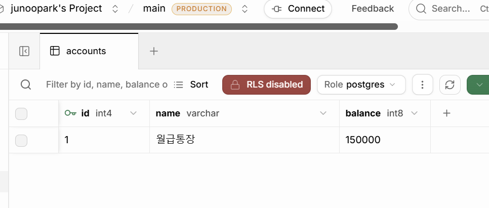

# ledger-api — 가계부 API

FastAPI + SQLAlchemy 2.0으로 만든 가계부 REST API.



## 실행

```powershell
python -m venv .venv
.venv\Scripts\Activate.ps1
pip install -r requirements.txt
uvicorn main:app --reload
```

API 문서: http://127.0.0.1:8000/docs

DB는 `.env`의 `DATABASE_URL`로 지정한다. 없으면 SQLite(`ledger.db`)를 쓴다.

## 엔드포인트

| 메서드 | 경로 | 설명 |
| --- | --- | --- |
| POST | `/accounts` | 계좌 생성 |
| GET | `/accounts` | 계좌 목록 |
| GET | `/accounts/{account_id}` | 계좌 조회 |
| GET | `/accounts/{account_id}/detail` | 계좌 + 거래 목록 |
| POST | `/transactions` | 거래 생성 |
| GET | `/stats/by-category` | 카테고리별 지출 합계 |
